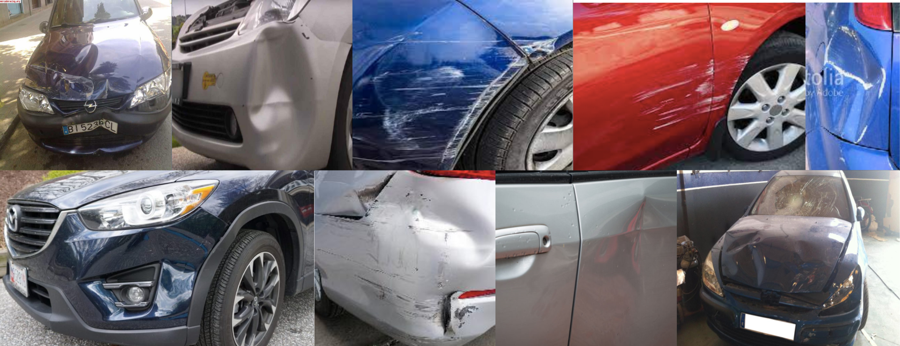
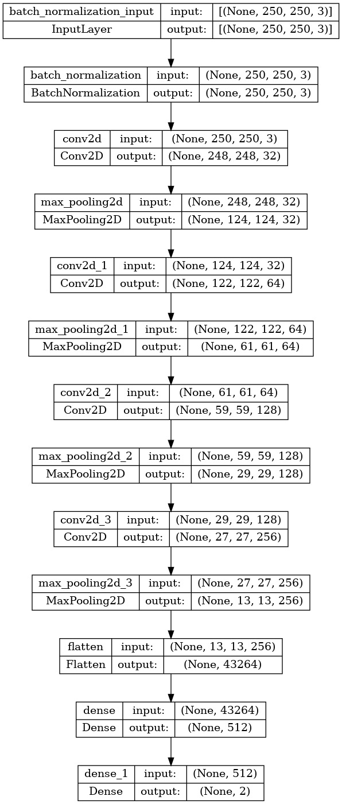
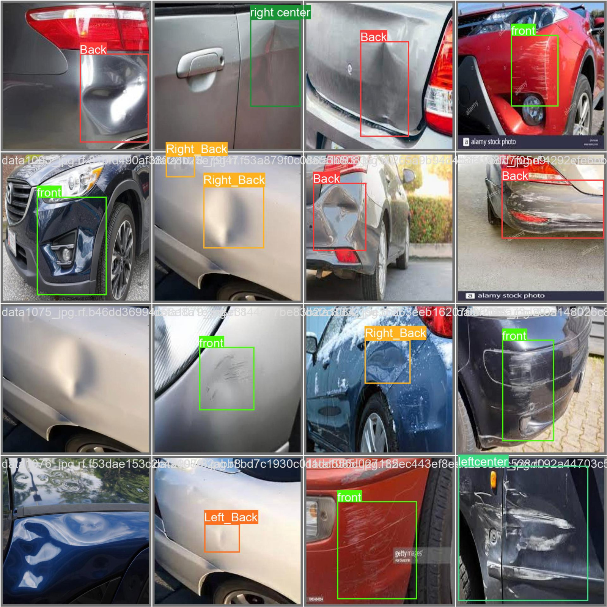
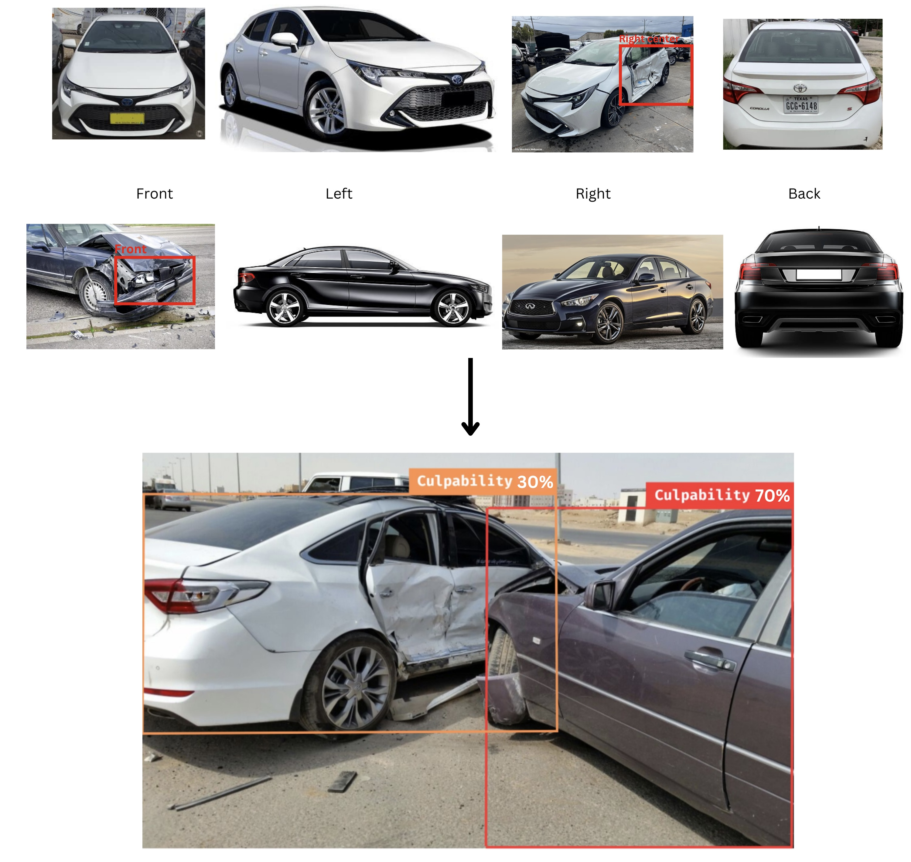
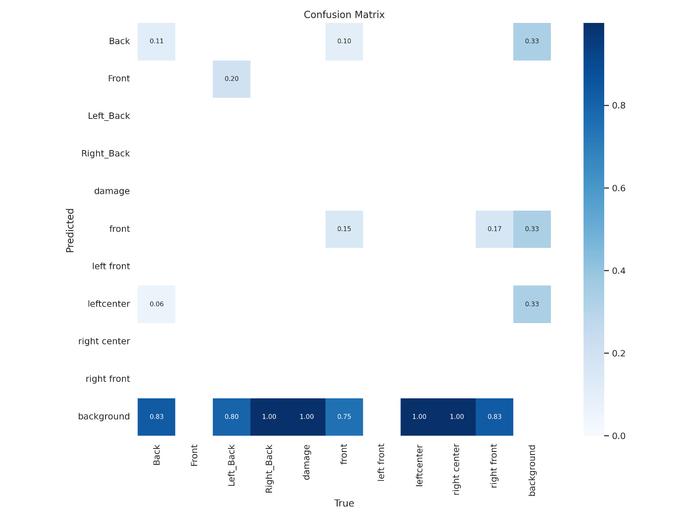

# Intelligent Culpability Detection System Using Computer Vision
This project aims to automate the process of determining who is responsible for a car accident in order to reduce traffic congestion. Using computer vision🖥, we analyze the pictures 🎑 and determine if there is any damage and how deep it is. In addition, the vehicle's position is determined. Furthermore, using a fault recognition decision-making system, we determine which vehicle is responsible for the accident🚘, as well as the mistake percentage of each vehicle.

## Table of Contents

- [Data Preparation](#data-preparation)
- [Model Training](#model-training)
- [Evaluation](#evaluation)
- [Examples](#examples)
- [Results](#results)
- [Acknowledgments](#acknowledgments)
- [Contact](#contact)

## Data Preparation

- The damage detection model is trained on [Roboflow car damage](https://example.com/paper.pdf](https://app.roboflow.com/khadijah-baouthman-tvhkx/culpability-detection-system/2)https://app.roboflow.com/khadijah-baouthman-tvhkx/culpability-detection-system/2) dataset. Then, it anotated manually.
  
- The damage depth predection model trained on [Fast, Furious and Insured](https://www.kaggle.com/datasets/infernape/fast-furious-and-insured) dataset.

  

## Model Training
The first model is a pre-trained model called You Only Look Once (YOLO). We focused on a [YOLOv8](https://github.com/ultralytics/ultralytics) for damage detection. For the second model, a convolutional neural network (CNN) is created from scratch to determine the depth of the damage as shown below. .

## Evaluation
Based on the following metrics, we evaluate the system to ensure that it provides accurate results. 
- Precision : A precision measurement indicates how
many positive predictions were correct (true positives). This is the formula:
\\ $Precision=\frac{TP}{TP+FP}$

- Recall: The recall measures how many positive cases
were correctly predicted by the classifier, over all the
positive cases in the data. Sometimes it is called sensi-
tivity. This is the formula:
\\ $Recall=\frac{TP}{TP+TN}$

• F1: The F1-Score combines precision and recall. It is
described as the harmonic mean of the two. In general,
harmonic means are described as more suitable for ra-
tios (such as precision and recall) than their [10]. 
This is the formula: 
\\ $F_{1}=\frac{\text{Precision} \times \text{Recall}}{\text{Precision} + \text{Recall}}$

• mAP: The mean average precision calculates a score
based on the ground-truth bounding box and the de-
tected box. The higher the score, the better the detec-
tion accuracy of the model. 

In addition, the loss function is used to determine how far an algorithm is from its expected output and how algorithms model data.

## Examples
The following are some examples of the output:
- Damage Detection
  
- Culpability Detection Decision making System
  

## Results

The following image illustrates the outcomes derived from the eval-
uation metrics applied to the model subsequent to its train-
ing across 25 epochs. The mean Average Precision (mAP)
yielded a value of 30%, precision achieved 26.4%, and re-
call 39.3%. As mention in Evaluation metrics section, the
metrics’ performance demonstrates enhancement with in-
creasing their values.

## Acknowledgments
Thanks are due to the supervisor [Achref Rebai](Achref Rebai github) for his guidance.
You can download the paper [here](https://example.com/paper.pdf).

## Contact
Feel free to contact us with any questions or feedback:

- Hebah Soleman: Hebah.Omer@gmail.com
- Ehab Abu-Alqumboz: Ehab.qmbz@gmail.com
- Khadijah Baothman: KhadijahBaothman@gmail.com
- Rand Barnawi: Rand.A.Barnawi@gmail.com

